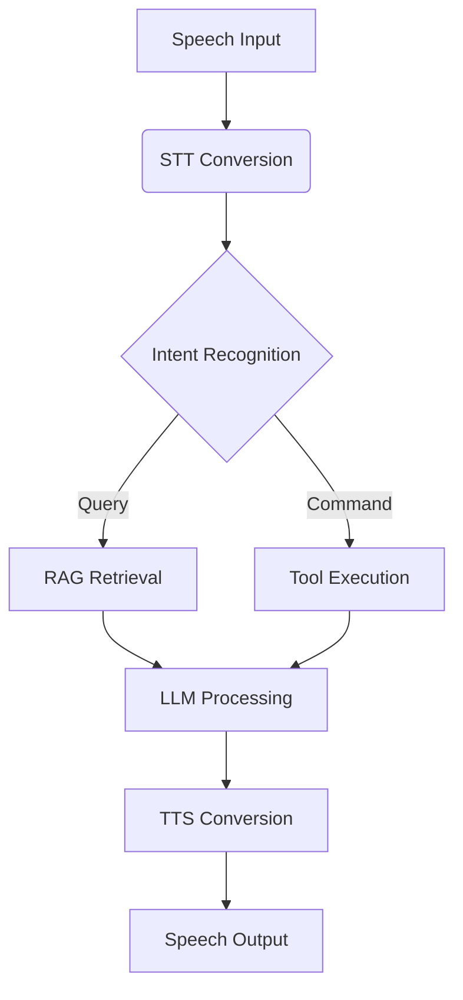

CALL.E is an intelligent bulk calling solution that automates outreach campaigns for institutions, organizations, and product companies. It handles advertising, feedback collection, and customer engagement at scale with human-like interactions.

---


## 🌟 Key Features
- **📞 Bulk Call Processing:** Simultaneously manage thousands of calls
- **🧠 Context-Aware Conversations:** Powered by Gemini API (replacing Llama-3.3-70B)
- **🎙️ Real-time Speech Processing:** Google Cloud Text-to-Speech (TTS) and Speech-to-Text (STT) APIs
- **🔍 Smart Retrieval (RAG):** Pinecone vector store with Hugging Face embeddings
- **📊 Performance Tracking:** WandB-integrated monitoring and optimization
- **🧩 Dynamic Chunking:** Context-aware text processing with overlap

---


## 🛠️ Tech Stack
| Component        | Technology                        |
|-----------------|--------------------------------|
| **LLM Backbone** | Gemini API (Google)             |
| **Speech Processing** | Google Cloud TTS/STT            |
| **Vector Store** | Pinecone                        |
| **Embeddings** | Hugging Face (sentence-transformers) |
| **MLOps** | WandB                            |
| **Framework** | LangChain                        |

---

## 🚀 Getting Started
### Prerequisites
- Python 3.9+
- Gemini API Key
- Pinecone API Key
- WandB Account


### Installation
```bash
# Clone repository
git clone https://github.com/yourusername/CALL.E.git

# Backend setup
cd backend
pip install -r requirements.txt

# Frontend Setup
cd ../frontend
npm install
```

### ⚙️ Configuration
Create a `.env` file and add the following keys:
```sh
GEMINI_API_KEY=your_gemini_key
PINECONE_API_KEY=your_pinecone_key
WANDB_API_KEY=your_wandb_key
INDEX_NAME=your_index_name
```

---

## 🧠 Intelligent Pipeline

```mermaid
graph TD
A[Speech Input] --> B(STT Conversion)
B --> C{Intent Recognition}
C -->|Query| D[RAG Retrieval]
C -->|Command| E[Tool Execution]
D --> F[LLM Processing]
E --> F
F --> G[TTS Conversion]
G --> H[Speech Output]
```

---

## 📂 Project Structure
```
CALL.E/
├── backend/            # Core AI components
│   ├── src/            # Source files
│   │   ├── chains.py   # Conversation workflows
│   │   ├── models.py   # LLM & Vector Store config
│   │   ├── tools.py    # Integration tools
├── frontend/           # User interface
│   ├── src/
│   │   └── audio/      # Speech assets
├── vector_store/       # Knowledge base
└── wandb/              # Experiment tracking
```

---

## 🏎️ Quick Start Example
```python
# Initialize AI agent
from src.models import get_retriever, create_rag_chain

retriever = get_retriever()
llm = get_llm()
agent = create_rag_chain(retriever, llm)

# Start conversation
response = agent.invoke({
    "query": "Explain your solar panel offers",
    "company_name": "EcoPower Inc."
})
print(response["result"])
```

---

## 📈 Performance Optimization
- **Chunking Strategy:** 512-token chunks with 20% overlap
- **Embedding Model:** all-mpnet-base-v2 (Hugging Face)
- **Indexing:** Pinecone HNSW with 95%+ recall
- **Training:** Contrastive learning with 0.0001 lr


---

## 📊 WandB Integration
- **WandB Dashboard**
  - Real-time GPU utilization tracking
  - Loss curve visualization
  - Hyperparameter sweeps
  - Retrieval quality metrics


---
## Conclusion

CALL.E is a breakthrough in AI-powered bulk calling, enhancing large-scale communication with efficiency and precision. With Gemini LLM integration, speech recognition via Google Cloud APIs, retrieval-augmented generation, and real-time performance tracking, CALL.E stands as a premier solution for automated outreach. Its success at NEURATHON 2025 solidifies its impact on AI-driven customer interaction and scalability.

